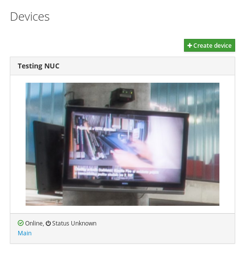
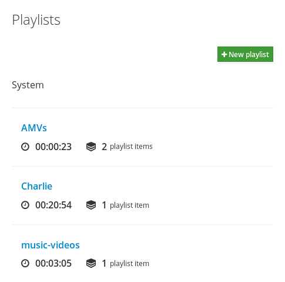

# Indoktrinátor: Digital Signage

This is the management component of an information screen control solution for libraries and similar institutions. It utilizes the local file system as a source of the files to play back and maintains a database with programming information.





Apart from simple management of connected devices running the [Telescreen][] application, it allows all properly authorized users to create and modify programs.

Programs comprise of segments -- playlists scheduled for certain hours in an idealized week. Most playlists are automatically detected from the file system, but synthetic ones can be created freely.

The solution does not support multicast streaming or web-based content uploading. We expect that the files are made accessible using a Samba or NFS share. Content is transmitted using HTTP and use of a reverse proxy is highly recommended.

Absence of streaming limits the amount of devices that can be deployed, but enables extremely fast content deployment with the ability to play back virtually anything without transcoding-induced quality degradation.


## Installation

First, you have to install requirements for your Linux distribution so that all required Python and JavaScript libraries can be built. For RHEL/CentOS 7 it can be done with the commands below. You need [EPEL][] repository for Python 3 and [NUX Desktop][] for FFMPEG.

```sh
yum groupinstall -y 'Development Tools'
yum install -y python34-devel npm ffmpeg
```

All Python dependencies can be fetched automatically with:

```sh
pip3 install -r requirements.txt
```

You might want to consider creating a sandbox (so-called [virtualenv][]) to hold these dependencies so that you do not clobber your system packages.

Next, you need to download the client code dependencies. This has been automated, but still requires `make` and `yarn`:

```sh
make
```


## Database

You need to install PostgreSQL database in case you do not already have it. Use PostgreSQL 9.4+ or newer. Assuming you are installing it on RHEL/CentOS 7+, start with adding the official PostgreSQL repository.

```sh
yum install -y https://download.postgresql.org/pub/repos/yum/9.6/redhat/rhel-7-x86_64/pgdg-redhat96-9.6-3.noarch.rpm
```

After that, the database itself needs to be installed:

```sh
yum install -y postgresql96-server postgresql96-contrib
```

And then initialized:

```sh
/usr/pgsql-9.6/bin/postgresql96-setup initdb
```

Then you probably want to enable the service and make some basic configuration in `/var/lib/pgsql/9.6/data/pg_hba.conf`.

For proper sorting of files you need to compile and install pg extension [pg_strverscmp][].

```sh
yum install -y postgresql96-devel libunistring libunistring-devel
git clone https://github.com/singularita/pg_strverscmp.git
cd pg_strverscmp
make
make install
```

You need to initialize your database with the `sql/schema.sql` script. After creating the login role and the database as usual:

```sql
CREATE ROLE indoktrinator ENCRYPTED PASSWORD 'indoktrinator' LOGIN;
CREATE DATABASE indoktrinator OWNER indoktrinator;
\c indoktrinator
ALTER SCHEMA public OWNER TO indoktrinator;
```

You should just read the file in:

```sh
psql -U postgres indoktrinator <sql/schema.sql
```

And that's it.


## Running

Create a configuration file based on the included `config/indoktrinator.ini` and start the application with:

```sh
bin/indoktrinator -c config/indoktrinator.ini
```

If you feel like it, create an [unit file][] to start the application automatically.


## Authentication

The application does not perform any kind of authentication. You need to ensure that it receives a single HTTP header called `X-Roles` that includes roles of the current user. These roles are mapped to privileges using the rules in the `acl` section of the configuration file. Individual roles are extracted from the `X-Roles` header using the `\w+` regular expression. Valid formats include `omnipotent dictator` and `sysadmin;director`.

There is only one privilege level:

- `user` can access the application and manipulate with everything.

There are several ways to get this header set, but you probably want to use [httpd][] and either manipulate the headers directly or use the [Shibboleth SSO][].


## Documentation

Documentation requires `asciidoctor` with some add-ons:

```sh
gem install asciidoctor asciidoctor-diagram
gem install --pre asciidoctor-pdf
```

Since it contains some diagrams, you also need `plantuml`:

```sh
yum install -y plantuml
```

You most probably do not care, since its just the original project specification written in Czech. Sorry for that.


[PostgreSQL]: http://www.postgresql.org/
[Python 3]: https://en.wikipedia.org/wiki/History_of_Python#Version_3.0
[Twisted]: https://twistedmatrix.com/trac/
[virtualenv]: http://docs.python-guide.org/en/latest/dev/virtualenvs/
[unit file]: https://access.redhat.com/documentation/en-US/Red_Hat_Enterprise_Linux/7/html/System_Administrators_Guide/sect-Managing_Services_with_systemd-Unit_Files.html
[httpd]: https://httpd.apache.org/docs/2.4/
[Shibboleth SSO]: https://shibboleth.net/
[Telescreen]: http://github.com/techlib/telescreen/
[EPEL]: https://fedoraproject.org/wiki/EPEL
[NUX Desktop]: https://li.nux.ro/repos.html
[pg_strverscmp]: https://github.com/singularita/pg_strverscmp
